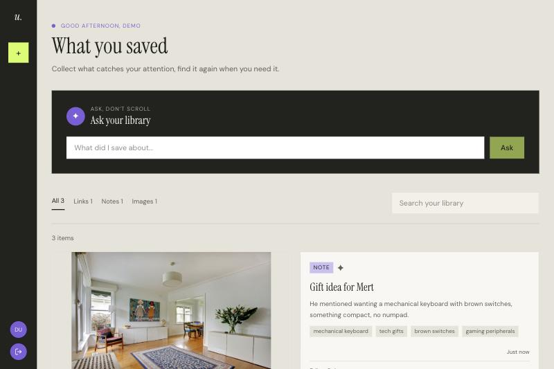
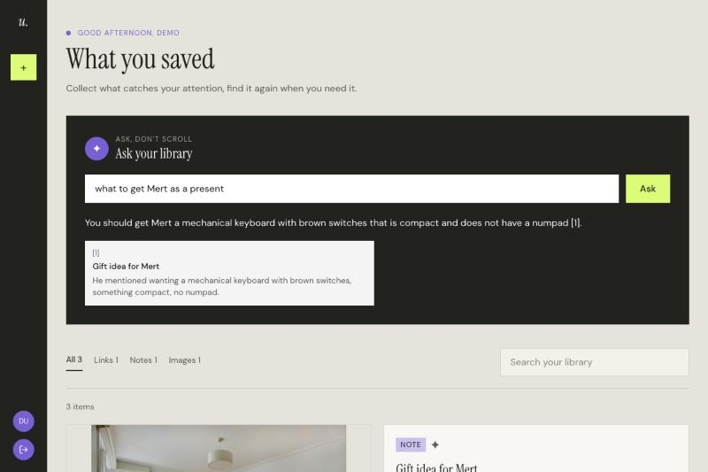

# Unlost

A personal "save it, find it later" tool. Drop in links, notes, and screenshots the moment they catch your attention, then find them again weeks later by describing what you remember — not by scrolling back through everything you've saved.



## Why this exists

Bookmark folders and screenshot camera rolls are where things go to be forgotten. Unlost is built around one idea: you shouldn't have to remember *where* you saved something, only roughly *what* it was about. That's the whole point of the "Ask your library" search — it's not keyword matching, it's semantic recall.



Ask something close to what you actually remember, and it finds the right item and answers using only what you've saved — it says so plainly when nothing matches, instead of guessing.

## What's technically interesting here

- **Grounded, cited RAG search.** A saved item's title, description, and tags are embedded with the Gemini Embedding API and stored in Postgres via `pgvector`. A question is embedded the same way, matched by cosine similarity, and the top matches are handed to Gemini with an explicit instruction: answer only from what's given, cite the item number, and say so if nothing actually answers the question.
- **Image recall without exposing AI text to the user.** Upload a screenshot and leave the description blank — Gemini's vision model writes a caption for it. That caption is never shown in the UI; it lives in a field used only for embedding and tag generation, so what you see is what you wrote, not a paragraph the model invented.
- **Background enrichment, not a blocking save.** Embedding and tagging happen after the response is already sent (via Next.js's `after()`), so saving an item stays fast instead of waiting on a live Gemini round trip.
- **Single-service architecture, on purpose.** Frontend and API routes live in the same Next.js app rather than a separate backend — a deliberate choice after hitting real third-party-cookie issues on a two-service setup in an earlier project. Same-origin sidesteps that whole class of bug.
- **Genuinely zero ongoing cost.** Gemini's free tier for both embeddings and generation, a free-tier Postgres instance, no paid services. The stack was chosen around that constraint, not despite it.

## Stack

Next.js 16 (App Router, Route Handlers) · TypeScript · Prisma · PostgreSQL + pgvector · Google Gemini API (embeddings, RAG, vision captioning) · Tailwind CSS

## Running it locally

There's no hosted demo — this app stores real user accounts and whatever they save, so a public deployment would mean hosting other people's data indefinitely with no way to moderate it. It's fully functional in under five minutes locally:

```bash
git clone https://github.com/burcakbilir/unlost.git
cd unlost
npm install

# Postgres with the pgvector extension
docker compose up -d

cp .env.example .env
# then fill in .env:
#   DATABASE_URL      — already correct for the docker-compose setup above
#   SESSION_SECRET     — any long random string
#   GEMINI_API_KEY     — free, from https://aistudio.google.com/apikey

npx prisma migrate dev
npm run dev
```

Open `http://localhost:3000`, register an account, and start saving things.

## Project structure

Feature-based, not layer-based — `src/app/**` holds only routing, everything else lives under `src/features/<name>/` and `src/lib/`. Auth is an httpOnly JWT cookie, checked in `src/proxy.ts` for route protection and verified server-side on every API call.
